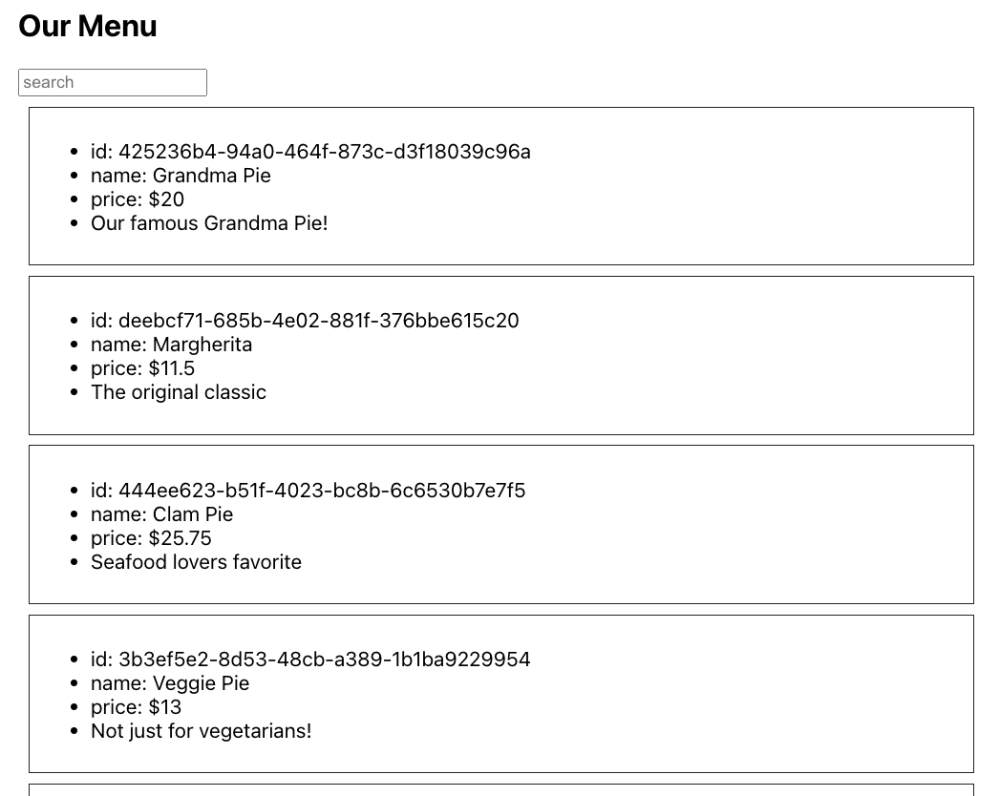
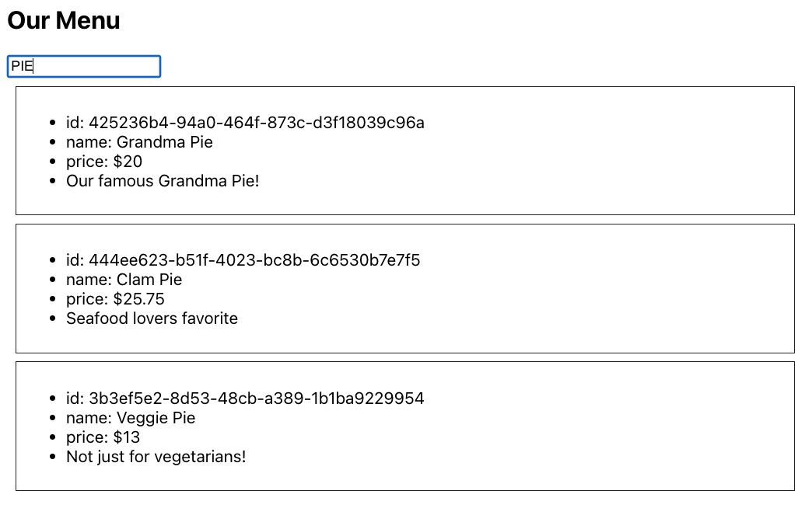
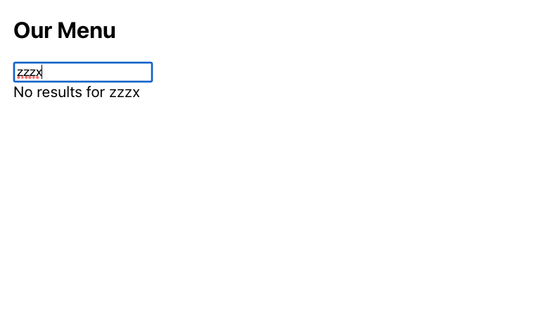

# Interview Practice: Menu App

Using this repo as a base, create an application that implements the following user stories.

1. When the application loads, I see a list of menu items fetched from an external API.
1. For each menu item, I can see the id, name, price, and a short description.
1. I can see a search bar above the menu items.
1. When I type in the search bar, the list will show only menu items whose name or short description include the search term.
1. Search should be case-insensitive.
1. If there are no search results for what I typed, I can see the text `No results for {search term}` where `{search term}` is what I typed.

## Setting up
1. Fork this repo and clone your fork to your computer.
1. Make sure that `npm install` and `npm start` work, and that you can view and edit the site.

## Implementation
1. The external API with menu items is this URL: https://px32id5fdg.execute-api.us-east-1.amazonaws.com/data
1. Your app **must** fetch the data from the external API above. Do not copy-paste or hard code the data.
1. For this task, you do not need to create loading or error states when fetching the data. Only add these if you have time.
1. Functionality is more important than design and it is recommended to save styling for last.
1. When you are finished or when time is up, commit your work, push it to your fork on GitHub, and create a pull request to the original.

## Example screenshots
Example screenshots are provided in the `/screenshots` folder. Your app does not have to look exactly like this, but you should give it a simple but clear design.

### Default state

### After user types

### No results
